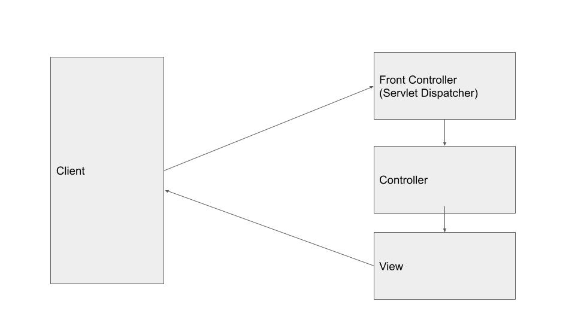

### Spring web 架構
不論是普通的MVC或是Restful service，他們的請求都會先經過一個Front controller又稱Dispatcher servlet，這個controler是由spring建立起來的，他會經手處理所有的request，建立起相關物件後，再把請求物件傳遞給自定義的controller，當商業邏輯完成後他會再依照設定呼叫相關的view，若是Restful則是直接回傳

