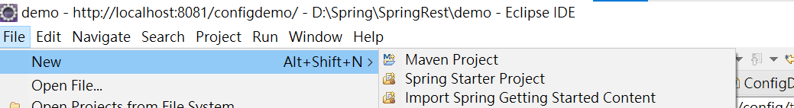
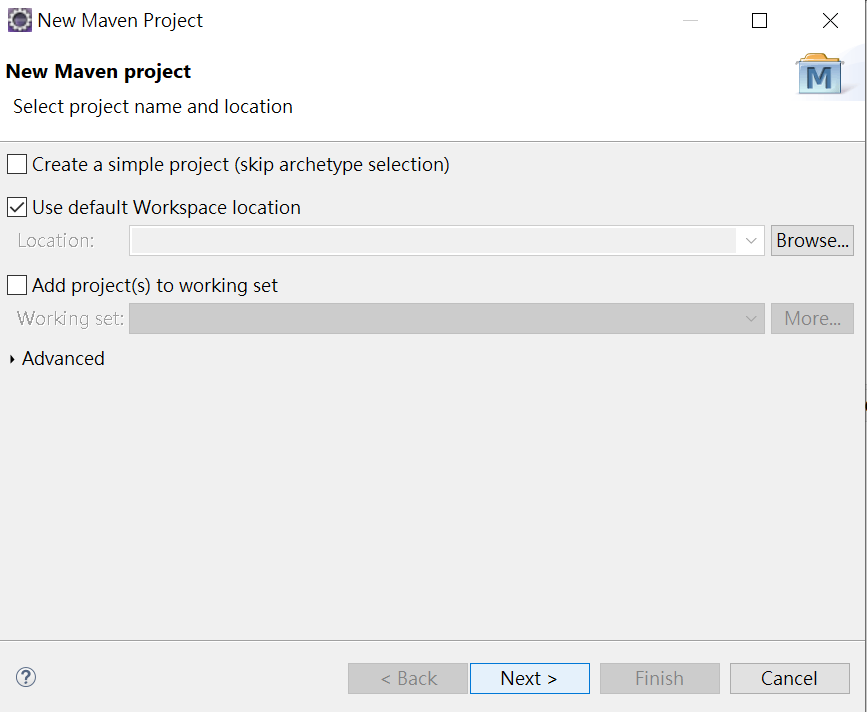
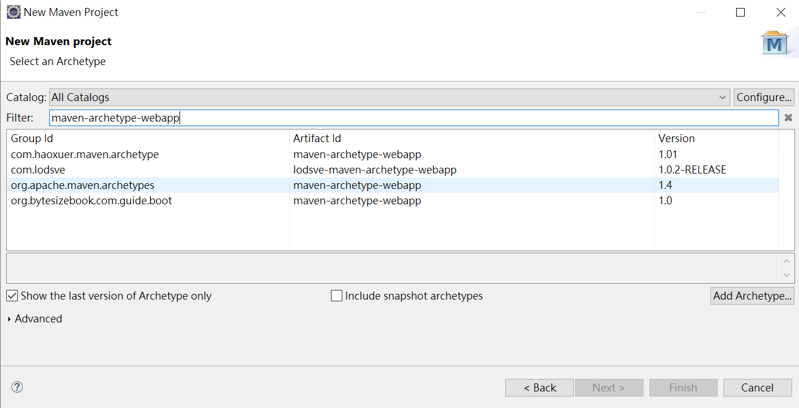
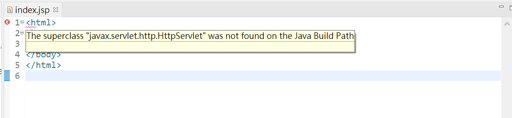
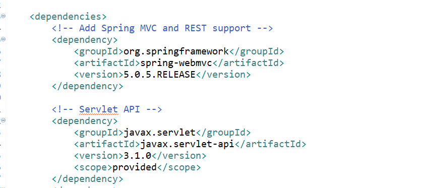
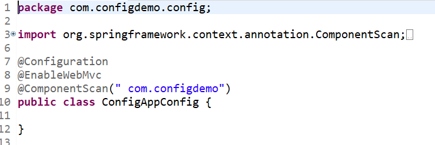
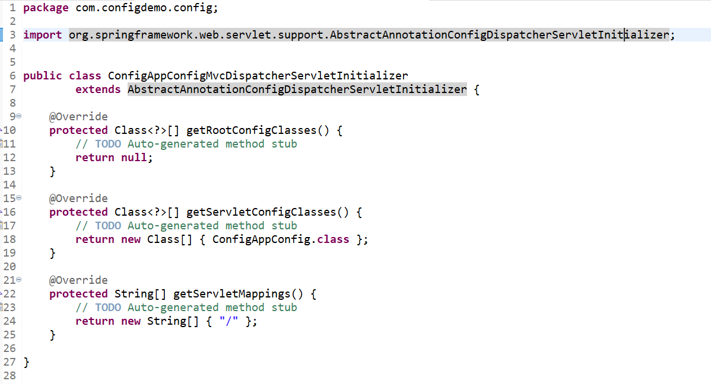

#  使用maven建立專案
  
  
1. 選取創建maven

2. 直接按下一步

3. 選擇maven-archetype-webapp ，要看清楚版本

4. 建立好之後會看到index.jsp有錯誤，這是因為這個專案還沒有相關的套件，因此要去pom.xml設定dependency下載相關套件

5. 設定pom.xml，套件可以去Maven Repository找

6. 建立java和resuources資料夾
mavan不會自動產生，所以要自己生成相關的資料夾，兩個都在src/main底下，java放的是所有的bean及相關程式，resources則可以放xml檔設定spring(若用xml做設定才需要)。

# 設定Spring config (no xml)
當maven檔設定好之後，就可以來創建spring的設定檔。
有兩個需要做: 
@Configuration和建立一個class繼承AbstractAnnotationConfigDispatcherServletInitializer，前者是spring的設定檔，後者則是在觀念中提到的Front controller設定。

1. @Configuration
設定可以被掃瞄的路徑

2. ConfigDispatcherServletInitializer
getServletConfigClasses : 指定spring的組態檔的class，就是第一個步驟的class。
getServletMappings : 設定這個front controller的路徑，設定說哪個URL要經過這個controller

